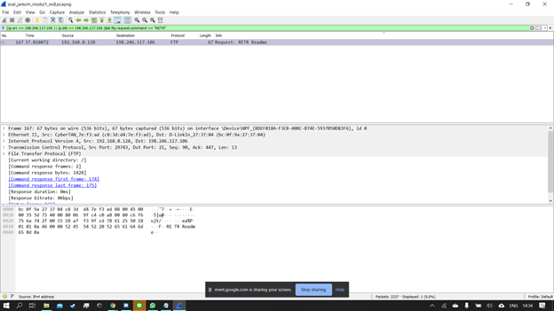
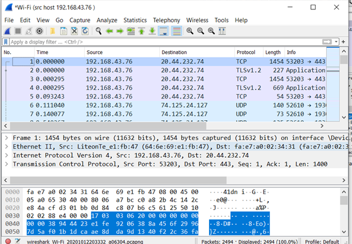

# Jarkom_Modul1_Lapres_E5
## Soal dan Jawaban
### 1. Sebutkan webserver yang digunakan pada "testing.mekanis.me"!
Jawaban :   

### 2. Simpan gambar "Tim_Kunjungan_Kerja_BAKN_DPR_RI_ke_Sukabumi141436.jpg"!
Jawaban :  

### 3. Cari username dan password ketika login di "ppid.dpr.go.id"!
Jawaban :   

### 4. Temukan paket dari web-web yang menggunakan basic authentication method!
Jawaban :   

### 5. Ikuti perintah di aku.pengen.pw! Username dan password bisa didapatkan dari file .pcapng!
Jawaban :   

### 6. Seseorang menyimpan file zip melalui FTP dengan nama "Answer.zip". Simpan dan Buka file "Open This.pdf" di Answer.zip. Untuk mendapatkan password zipnya, temukan dalam file zipkey.txt (passwordnya adalah isi dari file txt tersebut).
Jawaban :   

Open masing-masing dengan Follow ->TCP Stream -> Setting Raw -> Save as sesuai nama file   

### 7. Ada 500 file zip yang disimpan ke FTP Server dengan nama 1.zip, 2.zip, ..., 500.zip. Salah satunya berisi pdf yang berisi puisi. Simpan dan Buka file pdf tersebut. Your Super Mega Ultra Rare Hint = nama pdf-nya "Yes.pdf"
Jawaban :   

### 8. Cari objek apa saja yang didownload (RETR) dari koneksi FTP dengan Microsoft FTP Service!
Jawaban :   

### 9. Cari username dan password ketika login FTP pada localhost!
Jawaban :   

### 10. Cari file .pdf di wireshark lalu download dan buka file tersebut! clue: "25 50 44 46" 
Jawaban :  

### 11. Filter sehingga wireshark hanya mengambil paket yang mengandung port 21!
Jawaban:  

### 12. Filter sehingga wireshark hanya mengambil paket yang berasal dari port 80!
Jawaban :  

### 13. Filter sehingga wireshark hanya menampilkan paket yang menuju port 443!
Jawaban :  

### 14. Filter sehingga wireshark hanya mengambil paket yang berasal dari ip kalian!
Jawaban :  

### 15. Filter sehingga wireshark hanya mengambil paket yang tujuannya ke monta.if.its.ac.id!
Jawaban :  

---
## Kendala
- Kurang spesifik dalam pencarian yang jika dalam skala data yang lebih banyak akan memberikan hasil yang kemungkinan berbeda dengan yang seharusnya
